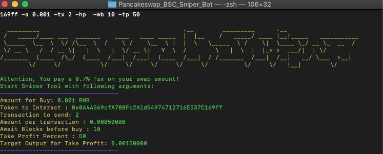

# 🚀 Pancakeswap BSC Sniper Bot 🚀
  
Web3 Pancakeswap Sniper && Take Profit/StopLose bot written in python3, Please note the license conditions!
### The second Binance Smart Chain sniper bot with Honeypot checker!  
  
# Infos
This Tool only buys/sells with/to BNB but use Multi Hops to get the best Output!
Attention, You pay **[0.1% Tax]** on your swap amount!

### Support Us&You by Buying [SavannahCat Token](https://bscscan.com/token/0x6989e34b435798f401d4ffc8987cdb8fa4d61766?a=0x0a4a569cfa700fc2a1d54974712716e537c169ff)  
  

# Download
### If you are not familiar with Python please have a look at [Releases](https://github.com/Trading-Tiger/Pancakeswap_BSC_Sniper_Bot/releases), there you can download Windows executable.
### Setup your Address and secret key in Settings.json and Run main-GUI.exe.

# Install
**First of all, you need install Python3+**
Run on Android you need Install [Termux](https://termux.com/)  
```shell
termux: $ pkg install python git
Debian/Ubuntu: $ sudo apt install python3 git make gcc
Windows: Need to install Visual Studio BuildTools & Python3
```

### Setup your Address and secret key in Settings.json.

Clone Repo:  
```shell
git clone https://github.com/Trading-Tiger/Pancakeswap_BSC_Sniper_Bot
cd Pancakeswap_BSC_Sniper_Bot
```

Install Requirements:  
```python
python(3) -m pip install -r requirements.txt
```  

Start Sniper:  
```python
python(3) Sniper.py -t <TOKEN_ADDRESS> -a <AMOUNT> -tx <TXAMOUNT> -hp -wb <BLOCKS WAIT BEFORE BUY> -tp <TAKE PROFIT IN PERCENT> -sl <STOP LOSE IN PERCENT>
python(3) Sniper.py -t 0x34faa80fec0233e045ed4737cc152a71e490e2e3 -a 0.001 -tx 2 -hp  -wb 10 -tp 50
python(3) Sniper.py -t 0x34faa80fec0233e045ed4737cc152a71e490e2e3 --sellonly
python(3) Sniper.py -t 0x34faa80fec0233e045ed4737cc152a71e490e2e3 -a 0.001 --buyonly
python(3) Sniper.py -t 0x34faa80fec0233e045ed4737cc152a71e490e2e3 -tsl 10 -nb
```  

Here are all options with infos:  
```python3
*'-t' or '--token', Token for snipe e.g. "-t 0x34faa80fec0233e045ed4737cc152a71e490e2e3"
'-a' or '--amount', float, Amount in Bnb to snipe e.g. "-a 0.1"

'-tx' or '--txamount', how mutch tx you want to send? It split your BNB amount in e.g. "-tx 5"

'-wb' or '--awaitBlocks', default=0, Await Blocks before sending BUY Transaction. e.g. "-ab 50" 

'-hp' or '--honeypot', if you use this Flag, your token get checks if token is honypot before buy!

'-nb' or '--nobuy', No Buy, Skipp buy, if you want to use only TakeProfit/StopLoss/TrailingStopLoss
'-tp' or '--takeprofit', Percentage TakeProfit from your input BNB amount. e.g. "-tp 50" 
'-tsl'or '--trailingstoploss', 'Percentage Trailing-Stop-loss from your first Quote "-tsl 50"

'-so' or '--sellonly', Sell ALL your Tokens from given token address
'-bo' or '--buyonly', Buy Tokens with your given amount

* = require every time its runs!
```
## Trailing-Stop-Loss:

